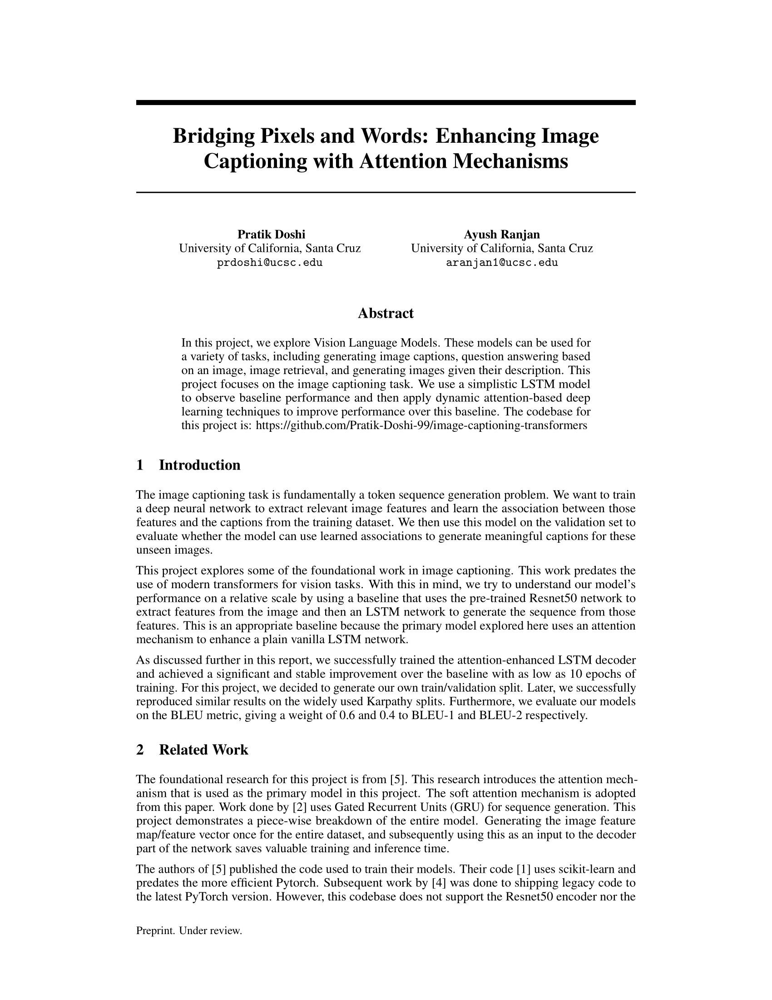
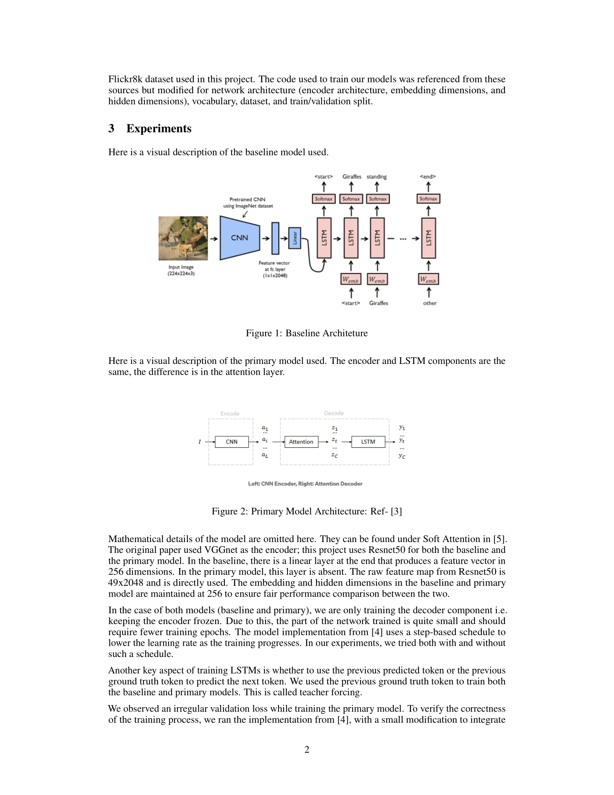
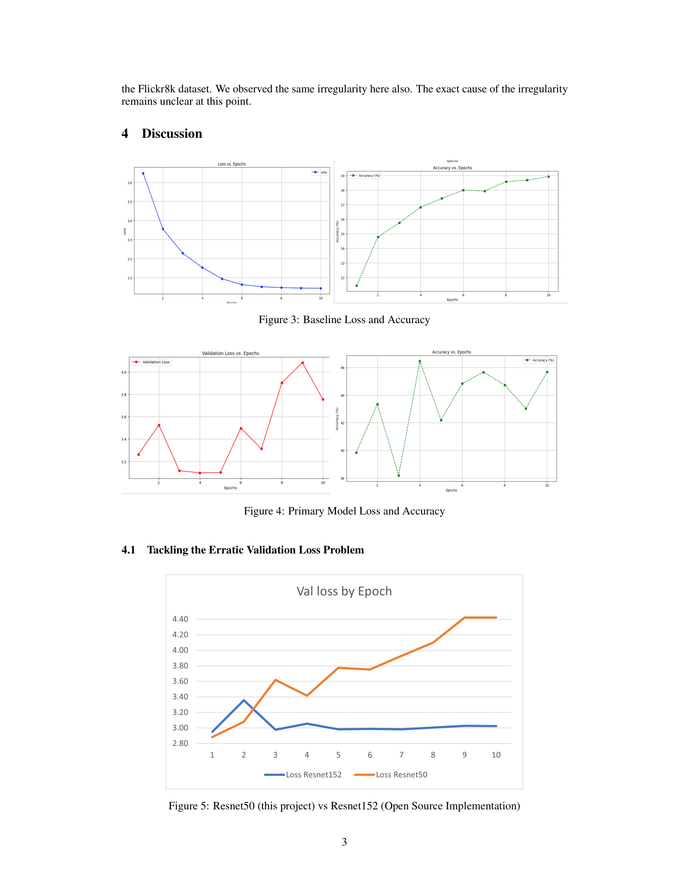
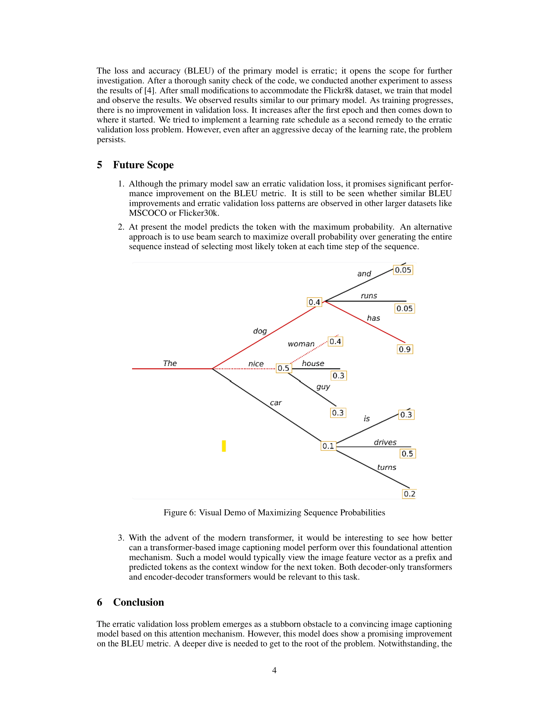
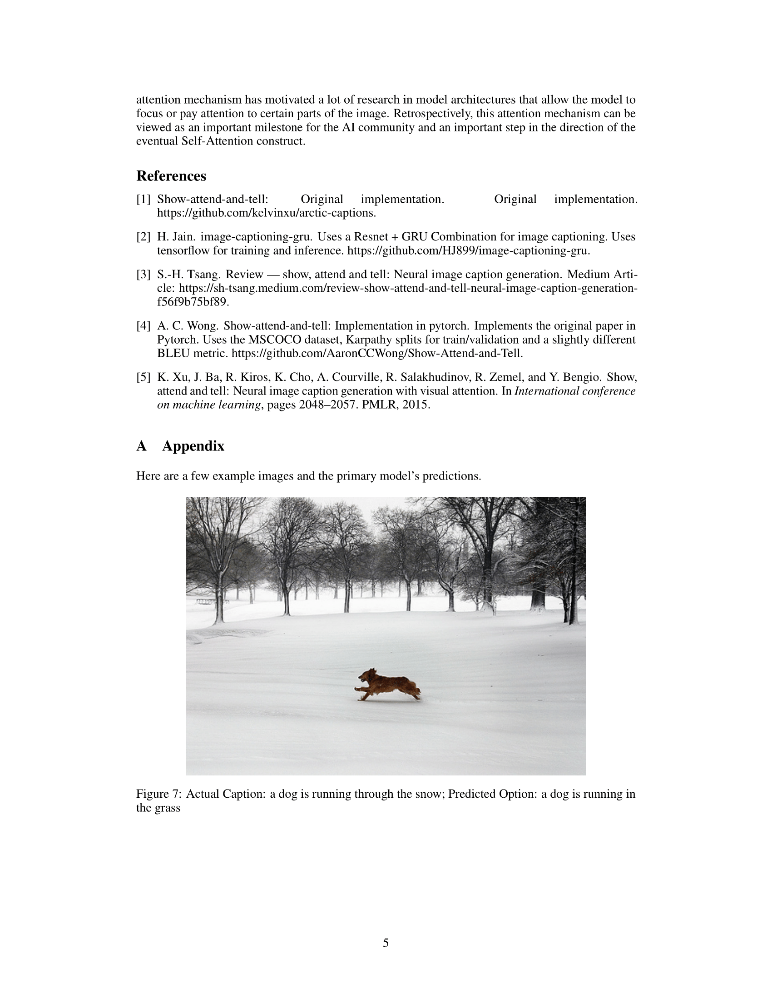
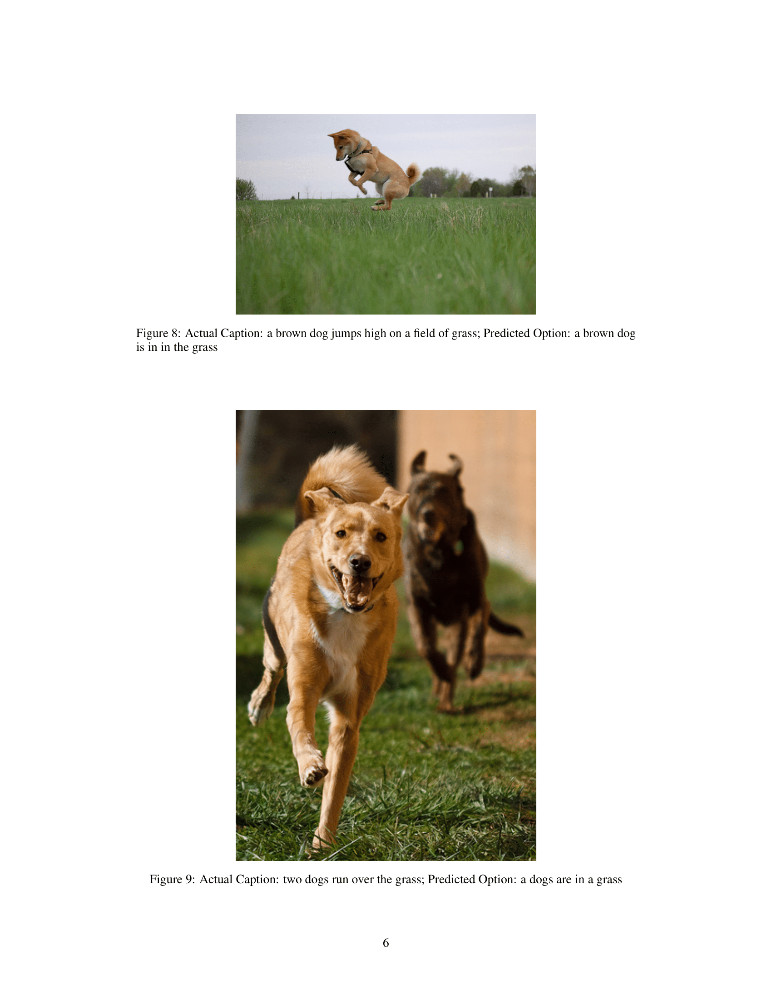

# Image Captioning using Attention Mechanisms

## Running the project

Model Baseline: Training.ipynb

Primary Model Training: attention_mech/train.py (view attention_mech/output.log for training logs)

Primary Model Inference: Inference.ipynb

## Configurations

| Configuration | File | Description
| ---  | --- | --- |
| DATASET | data.py | Link to ZIP.  |
| DEST_DIRECTORY | data.py | The name of the directory that contains the Images sub directory and captions.txt file. |

## Paper
Find the pdf [here](https://pratik-doshi-99.github.io/projects/Bridging_Pixels_Words.pdf).

## Data
[Flick8k](https://www.kaggle.com/datasets/adityajn105/flickr8k)

## References
1. [Image Captioning on Flickr8k with ResNet + GRU](https://github.com/HJ899/image-captioning-gru)

2. [Pytorch Implementation of Show, Attend and Tell](https://github.com/AaronCCWong/Show-Attend-and-Tell/tree/master)

